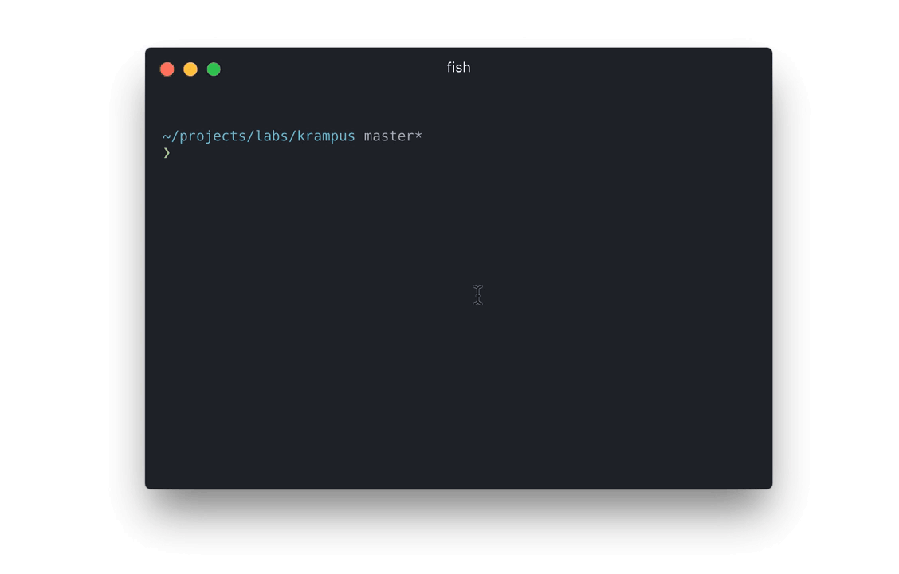

# krampus

> Kill processes occupying a port



* :rocket: dead simple
* :earth_africa: cross platform
* :santa: christmas-themed german name

## Installation

Grab it from npm

* `npm install -g krampus`

## Usage

```
❯ krampus -h

  Kill processes occupying a port

  Usage
    ❯ krampus <port> ...

  Options
    -h, --help  Print this help

  Examples
    ❯ krampus 1337
    Killed process with pid 1

    ❯ krampus 1337
    No process occupying port 1337 found

    ❯ echo '1337 1338' | krampus
    Killed processes with pid 1, 2
```

---
krampus is built by [marionebl](https://github.com/marionebl) and [contributors](https://github.com/marionebl/krampus/graphs/contributors). It is released unter the [MIT](https://github.com/marionebl/krampus/blob/master/LICENSE) license.
